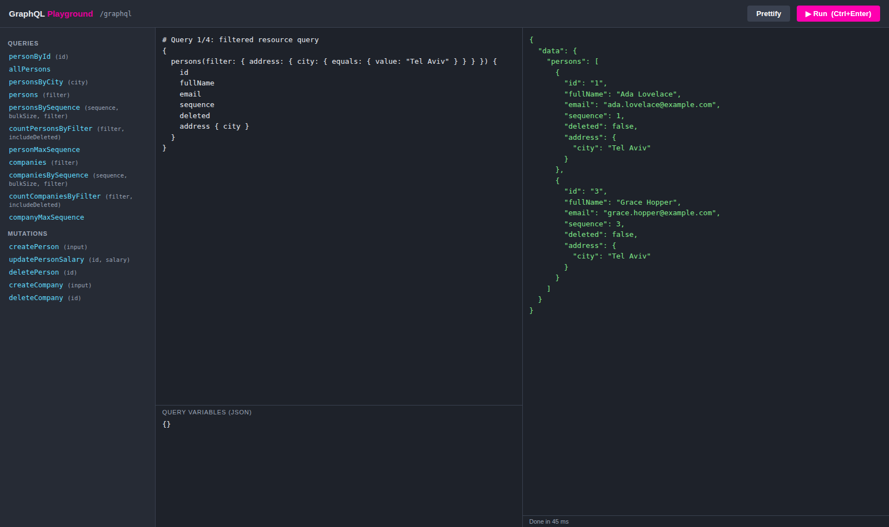
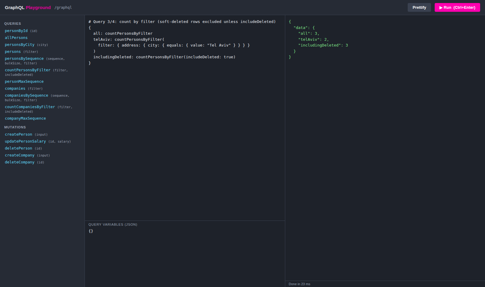
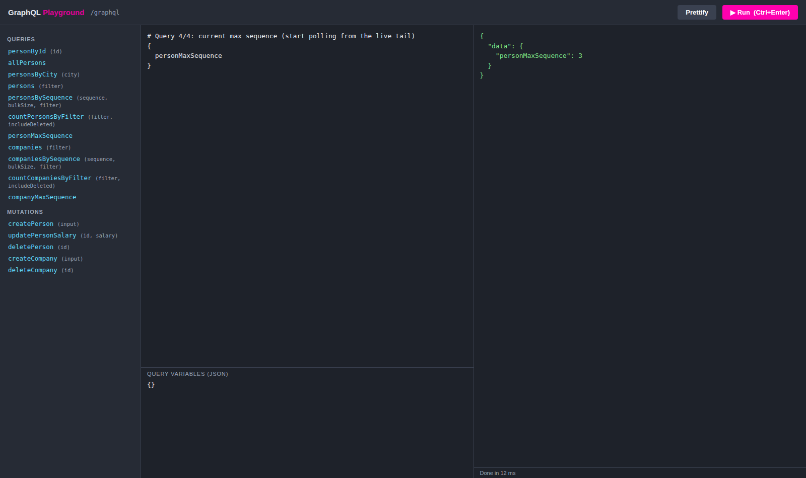
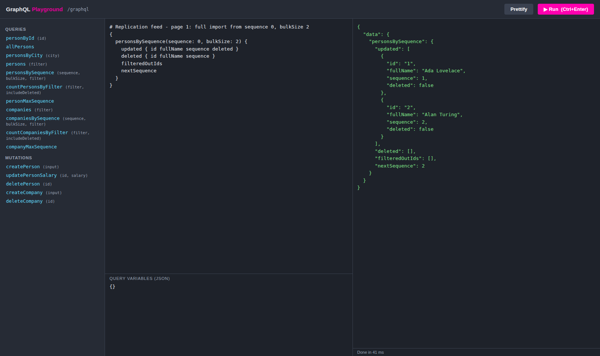
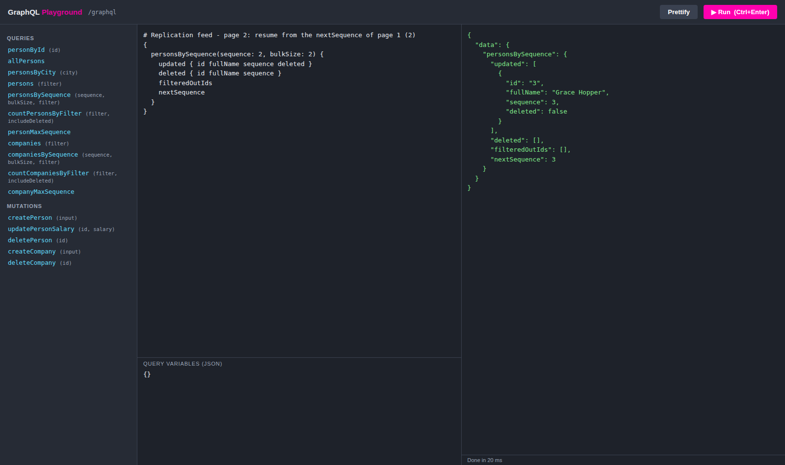
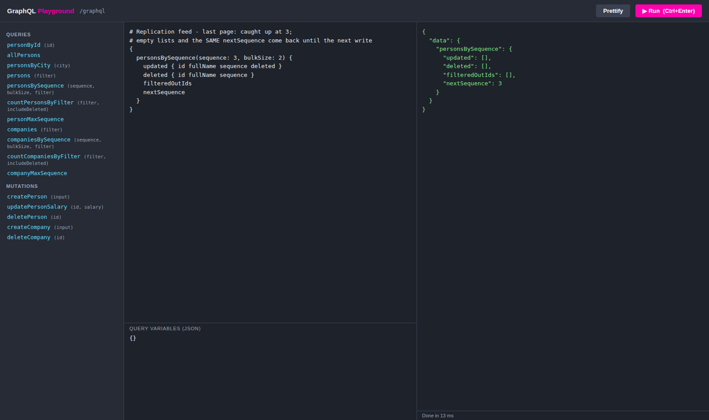
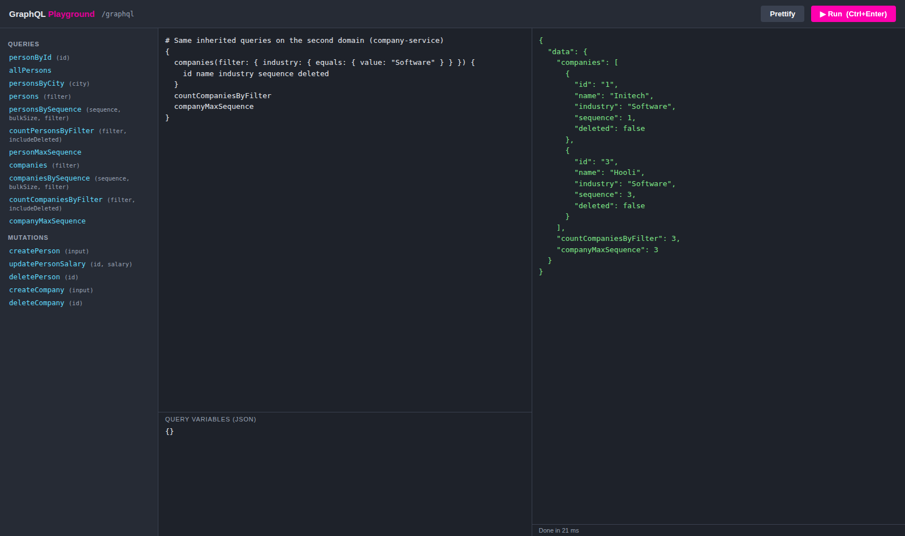

# API walkthrough — the four standard queries in the playground

A guided tour of the API using the self-hosted playground, with real screenshots from
a running instance. Every resource exposes the same four queries (filtered list,
replication feed, count-by-filter, max sequence — see
[REPLICATION.md](REPLICATION.md) for the protocol), so everything shown here for
`Person` works identically for `Company` and any future domain.

## Getting started

```bash
mvn package
java -jar person-service/target/person-service-1.0.0-SNAPSHOT.jar
```

Open **http://localhost:8080/playground**. The sidebar lists every query and mutation
discovered from the schema — note the symmetric set for both domains (`persons…` /
`companies…`). Click an operation to get a template, or paste the queries below.
The service seeds three persons (Ada Lovelace, Alan Turing, Grace Hopper — sequences
1–3) and three companies (Initech, Globex, Hooli) at startup.

## 1. Filtered resource query: `persons(filter)`

Filters compose from typed predicate inputs and combine with AND; nested objects
(like `address`) get their own filter input. Guarded by the query result cap. Note
the technical fields on every row: `sequence` and `deleted` come with the resource
because every resource is a replicated resource.

```graphql
{
  persons(filter: { address: { city: { equals: { value: "Tel Aviv" } } } }) {
    id
    fullName
    email
    sequence
    deleted
    address { city }
  }
}
```



## 2. Counting: `countPersonsByFilter(filter, includeDeleted)`

Counts without fetching (the result cap does not apply). Soft-deleted rows are
excluded unless `includeDeleted: true` — with it, a replication client can
sanity-check a finished import against the server's total.

```graphql
{
  all: countPersonsByFilter
  telAviv: countPersonsByFilter(
    filter: { address: { city: { equals: { value: "Tel Aviv" } } } }
  )
  includingDeleted: countPersonsByFilter(includeDeleted: true)
}
```



## 3. The feed's tail: `personMaxSequence`

The highest replication sequence currently in the table (0 when empty). A client that
doesn't need history starts polling from here instead of importing from 0.

```graphql
{
  personMaxSequence
}
```



## 4. The replication feed: `personsBySequence(sequence, bulkSize, filter)`

The feed returns the next `bulkSize` rows whose sequence is **strictly greater** than
the one you send, partitioned into `updated` (upsert locally), `deleted` (delete
locally) and — when a filter is used — `filteredOutIds` (rows in the page that don't
match the filter: drop any local copy). `nextSequence` is the resume point for the
next poll. The three requests below are a complete client session.

### Page 1 — full import from sequence 0

With `bulkSize: 2` and three rows in the table, the first page returns Ada (sequence
1) and Alan (sequence 2). `nextSequence` is **2** — the highest sequence *in the
page*, not the table's maximum, because the page was cut off by `bulkSize`.

```graphql
{
  personsBySequence(sequence: 0, bulkSize: 2) {
    updated { id fullName sequence deleted }
    deleted { id fullName sequence }
    filteredOutIds
    nextSequence
  }
}
```



### Page 2 — resume from the server's `nextSequence`

Feed the returned `nextSequence` (2) straight back in. Strictly-greater-than means
Alan (sequence 2) is not re-delivered; the page contains Grace (sequence 3) and
`nextSequence` is now **3** — the table's tail.

```graphql
{
  personsBySequence(sequence: 2, bulkSize: 2) {
    updated { id fullName sequence deleted }
    deleted { id fullName sequence }
    filteredOutIds
    nextSequence
  }
}
```



### Last page — caught up

Polling with the tail (3) returns **empty lists and the same `nextSequence: 3`
back**. This is the idle state of the protocol: keep re-sending the value you last
received and you'll keep getting empty pages until the next write bumps the tail —
no row is ever delivered twice, and none is ever skipped. (If you ever send a
sequence *beyond* the tail, `nextSequence` snaps back down to the real maximum so
you resume from an actual position.)

```graphql
{
  personsBySequence(sequence: 3, bulkSize: 2) {
    updated { id fullName sequence deleted }
    deleted { id fullName sequence }
    filteredOutIds
    nextSequence
  }
}
```



The whole client loop, in pseudocode:

```text
next := 0                        # or personMaxSequence to start at the live tail
loop:
    page := personsBySequence(sequence: next, bulkSize: 100, filter: F)
    upsert page.updated
    delete page.deleted, page.filteredOutIds
    next := page.nextSequence
```

Two behaviors not shown in the screenshots (fresh database), both covered by the
integration tests: a **soft-deleted** row arrives once in `deleted` at its
post-delete sequence, and with a **filter** the non-matching rows of a page are
reported in `filteredOutIds` so a resource that "left" the filter gets dropped
locally.

## 5. Same queries, second domain

The company module wrote no resolver, DAL or service code for its four standard
queries — they're inherited from the infrastructure — yet the API surface is
identical, on an independent per-table sequence:

```graphql
{
  companies(filter: { industry: { equals: { value: "Software" } } }) {
    id name industry sequence deleted
  }
  countCompaniesByFilter
  companyMaxSequence
}
```


