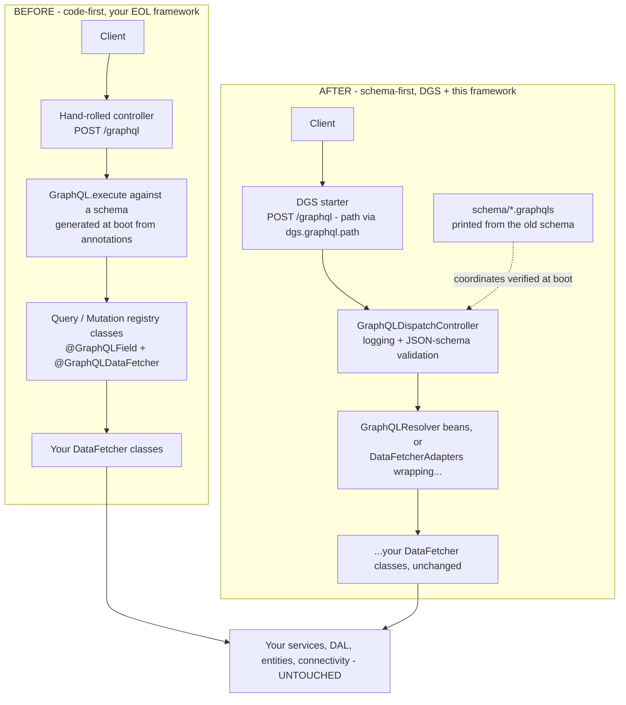
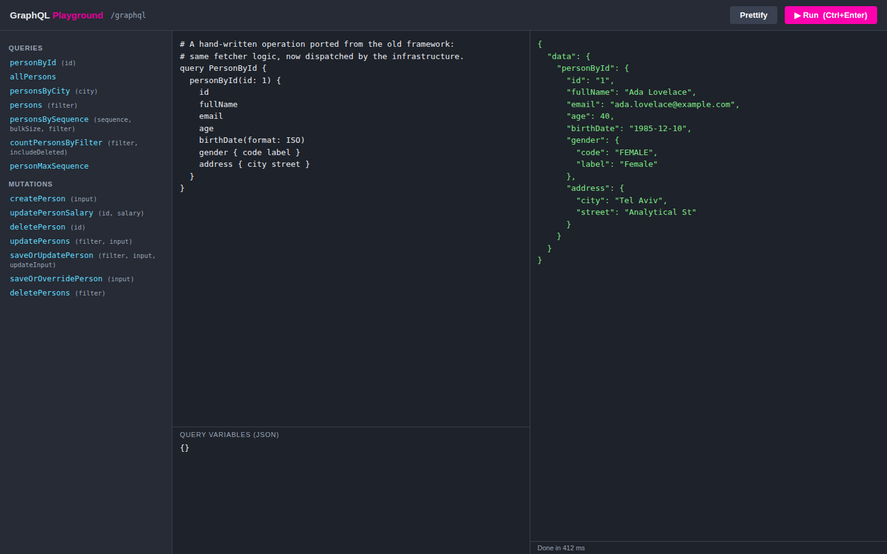
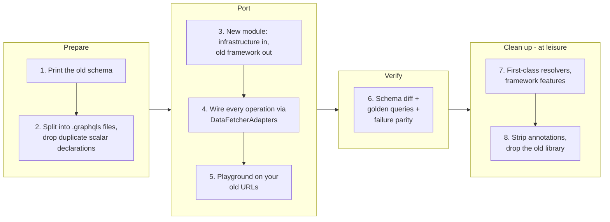

# Migrating from graphql-java-annotations to this framework

A practical guide for moving an existing GraphQL service built on
[graphql-java-annotations](https://github.com/Enigmatis/graphql-java-annotations)
(typically wrapped by an in-house framework) onto the DGS-based infrastructure in this
repository — **keeping your service layer, DAL, entities and connectivity untouched**.
Only the GraphQL layer changes.

The guide assumes the classic graphql-java-annotations shape:

- a hand-rolled **GraphQL controller** that accepts `POST /graphql`, builds/holds the
  `GraphQLSchema` and calls `GraphQL.execute(...)`;
- **entities/POJOs annotated** with `@GraphQLField`, some fields carrying
  `@GraphQLDataFetcher(SomeFetcher.class)`;
- two **registry classes** — one for `Query`, one for `Mutation` — each listing every
  operation as an annotated member referencing its main fetcher class.

If that describes your service, every section below has a direct counterpart for you.

---

## 1. The one fundamental shift: code-first → schema-first

graphql-java-annotations is **code-first**: annotations on Java classes *generate* the
GraphQL schema at boot. DGS (and this framework) is **schema-first**: the schema is a
set of `.graphqls` SDL files, the single source of truth, and Java code is wired *to*
it. Everything else in the migration follows from this inversion:

| Code-first (yours today) | Schema-first (here) |
|---|---|
| The schema is implicit — derived from annotations, only visible via introspection | The schema is explicit — `src/main/resources/schema/*.graphqls`, reviewable in PRs |
| A typo in a fetcher reference fails at request time (or silently) | A resolver naming a nonexistent schema field **fails boot** (`GraphQLDispatchController` verifies every coordinate against the SDL) |
| Renaming a Java method silently renames the API | The API cannot change unless the SDL file changes |
| Nullability from `@GraphQLNonNull` | Nullability from `!` in SDL |
| Docs from `@GraphQLDescription` | Docs from SDL docstrings (`"..."`) |

The two stacks side by side — note that everything below the GraphQL layer survives
unchanged, including your fetcher classes if you take the adapter route (§5.1):



The practical consequence: **your first migration artifact is the SDL of your existing
service, printed from the running schema** (§3). It becomes the contract that
guarantees the new service is a drop-in replacement.

## 2. Concept-by-concept map

| graphql-java-annotations / in-house framework | This framework |
|---|---|
| Hand-rolled GraphQL controller (`POST /graphql`, `GraphQL.execute`) | **Delete it.** The DGS starter serves `POST /graphql`; `GraphQLDispatchController` (infrastructure, domain-agnostic) is the single entry point — logs each operation, runs opt-in JSON-schema validation, dispatches |
| `GraphQLAnnotations.object(QueryDef.class)` + manual `GraphQLSchema` assembly | Gone. DGS merges every `schema/*.graphqls` on the classpath (including inside the infrastructure jar) and builds the schema itself |
| Query registry class (one `@GraphQLField` + `@GraphQLDataFetcher` per query) | `type Query { ... }` in your `.graphqls` **plus one Spring bean per field**: either a `GraphQLResolver` implementation or a one-liner in a `@Configuration` class (see `PersonGraphQLConfig` / `CompanyGraphQLConfig`) |
| Mutation registry class | Same, with `type Mutation { ... }` and `GraphQLOperationType.MUTATION` |
| Fetcher class implementing `graphql.schema.DataFetcher` | Reusable **as-is** during migration via `DataFetcherAdapters` (§5.1), or rewritten as a `GraphQLResolver` (§5.2) |
| `@GraphQLDataFetcher` on an *entity field* (per-field fetcher) | `GraphQLFieldResolver` bean, `DataFetcherAdapters.field(...)`, or — for enum/temporal presentation — `@GraphQLModel`/`@GraphQLEnum`/`@GraphQLTemporal` on a view DTO |
| Plain `@GraphQLField` on a getter/field (no fetcher) | **Nothing.** SDL declares the field; graphql-java's default `PropertyDataFetcher` reads the same-named getter off whatever object your resolver returned |
| `@GraphQLName("x")` custom names | The SDL name is the name; Java side must expose a matching getter (or a field resolver) |
| `@GraphQLNonNull` | `!` in SDL |
| `@GraphQLDescription` | SDL docstring |
| `@GraphQLDeprecate` | `@deprecated(reason: "...")` in SDL |
| `@GraphQLTypeResolver` for interfaces/unions | `interface`/`union` in SDL + `@GraphQLModel("TypeName")` on the Java class — `GraphQLModelTypeResolver` resolves concrete types automatically |
| Custom scalars registered into the schema by hand | `@DgsScalar` beans; `Long`, `Date`, `DateTime` already ship in the infrastructure (`common.graphqls` + `scalars` package) |
| Method-parameter argument injection (`@GraphQLName("id") long id`) | `DataFetchingEnvironment.getArgument("id")`, with `GraphQLArgumentMapper` for typed/DTO conversion (§6) |
| In-house error handling in the controller | `GraphQLExceptionHandler` global boundary: throw `ApiException` subclasses with an `ErrorCode`, or add an `ExceptionMapper` bean per third-party exception type (`docs/EXTENDING.md`) |
| In-house request/response tweaks (interceptors) | graphql-java `Instrumentation` beans — DGS discovers and chains them (example: `NullFieldOmittingInstrumentation`) |
| In-house playground/console UI | GraphQL Playground via kickstart `playground-spring-boot-starter` (comes with `graphql-infrastructure`) — assets served from the jar, no CDN; URL, endpoint and on/off are properties (§10) |

One thing that does **not** change: `DataFetchingEnvironment`. Your in-house framework
sits on graphql-java, and so does DGS. The environment object your fetchers already
consume is the same class, same API — which is what makes the adapter in §5.1 a
zero-rewrite bridge.

## 3. Step 0 — print your current schema

Before touching anything, capture the schema your annotations generate today. Add a
one-off test (or `main`) to the **old** service:

```java
import graphql.schema.idl.SchemaPrinter;

SchemaPrinter.Options options = SchemaPrinter.Options.defaultOptions()
        .includeScalarTypes(true)
        .includeSchemaDefinition(true)
        .includeDirectives(false);
Files.writeString(Path.of("printed-schema.graphqls"),
        new SchemaPrinter(options).print(existingGraphQLSchema));
```

(Your framework already holds a `GraphQLSchema` instance to execute queries — print
that one. If it's buried, an introspection query against the running service plus any
introspection-to-SDL converter gives the same result.)

This file matters for two reasons:

1. **It bootstraps your `.graphqls` files.** Split it into
   `src/main/resources/schema/<domain>.graphqls`; you write almost no SDL by hand.
   One correction while splitting: **delete the `scalar` declarations the
   infrastructure already ships** — `Long`, `Date` and `DateTime` are declared in
   `common.graphqls`, which DGS merges from the classpath, and declaring a type twice
   fails the schema build at boot. Keep the *uses* of those scalars on your fields;
   drop only the printed declarations. The same rule applies to any other printed name
   that collides with `common.graphqls` (`DateFormat`, `EnumValue`, the filter inputs)
   if you adopt those features.
2. **It pins the contract.** graphql-java-annotations *derives* names — method
   `getFoo()` becomes field `foo`, input types get generated names like `PersonInput`,
   Java `long` becomes its own `Long` scalar. Clients depend on the derived names,
   whatever they are. The printed SDL captures the truth; never re-derive it from
   memory. At the end of the migration, print the new service's schema the same way and
   diff the two — the diff should contain only what you intentionally changed.

## 4. Step 1 — project setup

Create your service as a module depending on the infrastructure (copy
`person-service/pom.xml` as a template):

```xml
<parent>
    <groupId>com.example</groupId>
    <artifactId>dgs-demo</artifactId>
    <version>1.0.0-SNAPSHOT</version>
</parent>
...
<dependency>
    <groupId>com.example</groupId>
    <artifactId>graphql-infrastructure</artifactId>
</dependency>
```

Then **remove** from your build:

- the in-house framework jar and your hand-rolled controller/servlet registration;
- **any direct `graphql-java` pin** — its version is owned by the DGS BOM
  (`graphql-dgs-platform-dependencies`). A leftover pin from the old framework is the
  most likely way to break the new stack silently.

**Keep the graphql-java-annotations dependency for now** in any module whose sources
still carry `@GraphQLField`/`@GraphQLName`/`@GraphQLDataFetcher`: nothing reads those
annotations anymore, but the annotation *types* must stay on the compile classpath or
the annotated entity/DTO modules stop compiling. Stripping the annotations and then
dropping the dependency is the explicit **last** step of the migration (§13, step 8).
While it lingers, check with `mvn dependency:tree` that the DGS BOM's graphql-java
wins over anything the old library pulls in.

Keep your service-layer, DAL and entity modules exactly as they are and depend on them
from the new module. Mind the parent POM's documented landmines (README, "Library
conflicts and your options"): the `kotlin.version` override must stay, Jackson moves
only via `jackson-bom.version`.

> Your resolvers may return **your existing entities/DTOs directly**. The dispatch
> layer doesn't care what the returned object is, as long as each SDL field has a
> matching getter (or a field resolver). The view-DTO layer this demo uses
> (`PersonView` etc.) is the recommended end state — it decouples the API from
> persistence — but it is *not* a prerequisite for the port. Migrate first, introduce
> views later if you want them.

## 5. Step 2 — the Query/Mutation registry classes become beans

Your old registry:

```java
public class QueryDefinition {

    @GraphQLField
    @GraphQLDataFetcher(PersonByIdFetcher.class)
    public static Person personById(@GraphQLName("id") long id) { return null; }

    @GraphQLField
    @GraphQLDataFetcher(AllPersonsFetcher.class)
    public static List<Person> allPersons() { return null; }
}
```

splits into two things. First, SDL (taken from your printed schema):

```graphql
type Query {
    personById(id: ID!): Person
    allPersons: [Person!]!
}
```

Second, one bean per field — with two ways to get there.

### 5.1 The fast path: adapt your existing fetchers unchanged

Every graphql-java-annotations fetcher implements `graphql.schema.DataFetcher` — the
exact functional interface `DataFetcherAdapters`
(`com.example.infrastructure.graphql.migration`) wraps. Your whole registry class
becomes a `@Configuration`:

```java
@Configuration
public class PersonGraphQLConfig {

    @Bean
    GraphQLResolver personById(PersonByIdFetcher fetcher) {   // your class, unchanged
        return DataFetcherAdapters.query("personById", fetcher);
    }

    @Bean
    GraphQLResolver allPersons(AllPersonsFetcher fetcher) {
        return DataFetcherAdapters.query("allPersons", fetcher);
    }

    @Bean
    GraphQLResolver createPerson(CreatePersonFetcher fetcher) {
        return DataFetcherAdapters.mutation("createPerson", fetcher)
                .validating("input", "person-create");        // optional JSON-schema opt-in
    }
}
```

(Make the fetchers Spring beans — usually just adding `@Component` — so their own
dependencies inject; or `new` them in the `@Bean` method if they're self-contained.)

This gives you, with zero fetcher rewrites: boot-time verification that every
coordinate exists in the SDL, per-operation logging, opt-in server-side JSON-schema
validation, and the global error boundary. It's how you migrate **operation by
operation** with confidence.

### 5.2 The end state: first-class resolvers

Once an operation is stable, fold the fetcher into a `GraphQLResolver` (one class per
operation, like `PersonByIdResolver`):

```java
@Component
public class PersonByIdResolver implements GraphQLResolver {

    private final PersonService personService;          // your existing service, untouched
    private final GraphQLArgumentMapper argumentMapper;

    // constructor ...

    @Override public GraphQLOperationType operationType() { return GraphQLOperationType.QUERY; }
    @Override public String fieldName() { return "personById"; }

    @Override
    public Object resolve(DataFetchingEnvironment environment) {
        return personService.getPerson(argumentMapper.longArgument(environment, "id"));
    }
}
```

Delete the adapter line and the legacy fetcher class. Both styles coexist freely — the
registry indexes them identically — so the migration never needs a big-bang cutover.

## 6. Step 3 — arguments: from parameter injection to the environment

graphql-java-annotations injected arguments as annotated method parameters. Here the
resolver gets the full `DataFetchingEnvironment` (as your fetchers already did) and
pulls arguments itself. `GraphQLArgumentMapper` covers the three common shapes and
turns malformed input into a structured `INVALID_ARGUMENT` (400) instead of a leaked
parse exception:

```java
long id            = argumentMapper.longArgument(environment, "id");          // ID! as numeric
BigDecimal salary  = argumentMapper.decimalArgument(environment, "newSalary");
CreatePersonInput input = argumentMapper.argument(environment, "input", CreatePersonInput.class);
```

The last form replaces whatever input-object deserialization your old framework did:
graphql-java hands input objects over as `Map<String,Object>`, and the mapper converts
them to your existing input DTOs via Jackson by field name. Your DTOs almost certainly
work unchanged — same names, standard getters/setters.

## 7. Step 4 — per-field fetchers on entities

For `@GraphQLDataFetcher` on individual entity fields (computed/presented values),
pick per field:

- **No fetcher, plain field** → do nothing. SDL field + same-named getter is enough.
- **Bespoke logic** → a `GraphQLFieldResolver` bean (coordinate = type + field), or the
  no-rewrite bridge `DataFetcherAdapters.field("Person", "age", existingAgeFetcher)`.
  The row object your fetcher always read via `environment.getSource()` is still there.
- **Enum enrichment / temporal formatting** → this is a solved presentation concern:
  annotate the model class with `@GraphQLModel("Person")` and the field with
  `@GraphQLEnum("gender")` / `@GraphQLTemporal`; register the class in a one-line
  `GraphQLModelSource` bean. `AnnotatedFieldResolverFactory` generates the field
  resolvers at boot. See `PersonView` for a worked example.
- **Values derived from other fields** (fullName, age, bmi in this demo) → the demo's
  preferred pattern is computing them in the service/mapper into the returned DTO
  rather than per-field fetchers, but both work.

## 8. Step 5 — scalars, enums, interfaces

- **`Long`**: graphql-java-annotations mapped Java `long` to a `Long` scalar of its
  own; the infrastructure ships one (`common.graphqls` + `LongScalar`) under the same
  name, so fields typed `Long` keep working — just remember the printed
  `scalar Long` declaration itself must be deleted from your copied SDL (§3).
  `Date`/`DateTime` likewise exist; any other custom scalar of yours becomes a small
  `@DgsScalar` `Coercing` bean.
- **Enums**: a plain SDL `enum` + Java enum of the same constant names needs nothing.
  If your old API exposed enriched enum objects (code + label), that's the
  `EnumCatalog`/`EnumValue`/`@GraphQLEnum` mechanism.
- **Interfaces/unions**: declare in SDL. Every abstract type needs a type resolver,
  and the infrastructure's `GraphQLModelTypeResolver` covers only the technical
  `Resource` interface. For each interface/union of your own, replace the old
  `@GraphQLTypeResolver` implementation with a small `@DgsTypeResolver` method — the
  `@GraphQLModel` annotation serves as the source of concrete type names, the same
  pattern `GraphQLModelTypeResolver` uses for `Resource`:

  ```java
  @DgsComponent
  public class VehicleTypeResolver {

      @DgsTypeResolver(name = "Vehicle")
      public String resolveVehicle(Object value) {
          return value.getClass().getAnnotation(GraphQLModel.class).value();
      }
  }
  ```

## 9. Step 6 — errors

Whatever your controller did with exceptions is replaced by the global boundary:

- Business failures: throw (or translate to) `ApiException` subclasses carrying an
  `ErrorCode` → rendered as structured GraphQL errors with HTTP status, classification
  and `extensions`; add codes per `docs/EXTENDING.md`.
- Third-party exceptions you can't change: one `ExceptionMapper` bean each.
- Anything unknown renders as a generic `INTERNAL_ERROR` — internals never leak.

If your clients parse your current error payloads, diff a few known failure responses
old-vs-new early; error shape is the most common silent incompatibility in GraphQL
migrations.

## 10. Step 7 — the playground UI

If your framework also served an in-browser playground/console, that is replaced too —
and both of its URLs stay under your control, so nothing your users bookmarked or
integrated needs to change. `graphql-infrastructure` pulls in the standard GraphQL
Playground UI (graphql-java-kickstart's `playground-spring-boot-starter`); with the
starter's CDN mode off (the default) all assets are served from the starter's own jar,
so it needs no CDN access and works offline. There is nothing to wire — it arrives
with the infrastructure dependency you already added in §4.

All knobs are properties, no code:

| Property | Default | Purpose |
|---|---|---|
| `graphql.playground.mapping` | `/playground` | The URL the page is served at — set it to your old framework's playground URL to preserve bookmarks and links |
| `graphql.playground.endpoint` | `/graphql` | The GraphQL endpoint the page sends queries to |
| `graphql.playground.enabled` | `true` | Kill switch, e.g. `false` in a production profile |
| `graphql.playground.cdn.enabled` | `false` | Keep `false` for offline/locked-down environments |

If your old service exposed the **API itself** under something other than `/graphql`,
that is DGS's knob: set `dgs.graphql.path` and point `graphql.playground.endpoint` at
the same value.

Separately, DGS serves its own GraphiQL at `/graphiql` by default. It loads its assets
from a CDN, so in offline or locked-down environments it renders a blank page — the
jar-served playground is the dependable one. Keep GraphiQL alongside it or turn it
off with `dgs.graphql.graphiql.enabled=false`.

This is what your users get: the schema/docs tabs are built live from introspection
(every operation you wired shows up automatically — a quick visual check that nothing
got lost in the port), and running one of the demo's ported operations exercises the
enum enrichment and temporal formatting presentation features. (The screenshot below
predates the switch to the kickstart Playground starter and shows the previous
self-hosted UI — the query and response are identical.)



For a screenshot-guided tour of the playground against the framework's standard
queries (filtering, counting, the replication feed), see
[API-WALKTHROUGH.md](API-WALKTHROUGH.md).

## 11. Verifying the port

1. **Schema diff**: print the new schema (same `SchemaPrinter` snippet — or hit
   introspection) and diff against `printed-schema.graphqls` from §3. Only intended
   changes may appear.
2. **Golden queries**: collect your clients' real queries (top N from logs), run each
   against old and new side by side, diff the JSON. The demo's integration tests
   (`PersonGraphQLIntegrationTest`) show the Spring Boot test setup for executing
   GraphQL over HTTP in-process.
3. **Failure parity**: repeat for the known error cases (§9).

Behavioral gotchas to check deliberately:

| Gotcha | Detail |
|---|---|
| Derived field names | `getFoo()`→`foo`, custom `@GraphQLName`s, generated input-type names — trust only the printed SDL |
| Null fields in responses | The GraphQL spec requires requested fields with `null` values to appear explicitly. If your old framework stripped them, this stack reproduces that with `graphql.response.omit-null-fields=true` (`NullFieldOmittingInstrumentation`) — off by default |
| Relay connections | If you used `@GraphQLConnection`, there is no counterpart here; the demo's list/filter/replication queries (§12) are the offered alternative, or model the connection types explicitly in SDL |
| graphql-java version jump | Your old stack likely bundles an older graphql-java; DGS 4.9.x brings 17.x. Validation/coercion messages and some edge-case behavior (e.g. stricter Int overflow rules) differ — golden-query diffs catch this |
| Batching/N+1 | If your in-house framework had a dataloader story, DGS has first-class `@DgsDataLoader` support you can adopt where needed |

## 12. What you get beyond parity (adopt later, optional)

The port above reaches feature parity. These framework capabilities are then available
per domain, opt-in, without touching the infrastructure — each is one schema block plus
one-line beans against your existing service class (see `CompanyGraphQLConfig` for the
complete minimal wiring, `docs/EXTENDING.md` for recipes):

- **Typed filtering** over any field including nested paths (`docs/FILTERING.md`) with
  a result cap.
- **The four standard queries + five standard mutations** manufactured by
  `ReplicationResolverFactory`/`MutationResolverFactory` — no resolver code.
- **Sequence-based replication feeds** and soft deletes (`docs/REPLICATION.md`) for
  entities that extend `BaseEntity`.
- **JSON-schema input validation** (`.validating(...)`) — works on adapted legacy
  fetchers too.
- **Cross-service references / federation readiness** (`docs/FEDERATION.md`).

## 13. Suggested order of work



1. Print + freeze the old schema (§3). Split into `.graphqls` files.
2. New module, dependencies in / old framework out (§4).
3. Boot with an empty config — DGS serves the schema; every unresolved field simply
   returns null. Nothing crashes.
4. Wire **all** operations via `DataFetcherAdapters` (§5.1) — mechanical, an hour or
   two even for a large API, and the boot-time coordinate check immediately flags any
   name you got wrong.
5. Pin `graphql.playground.mapping` (and, if needed, `dgs.graphql.path`) to your old
   framework's URLs (§10) — the playground itself ships with the infrastructure.
6. Run the golden-query + schema diffs (§11). Fix until clean. **You are now
   migrated.**
7. At leisure: convert adapted fetchers to first-class resolvers (§5.2), move
   presentation to `@GraphQLModel` annotations (§7), adopt filtering/replication/
   standard mutations where they replace bespoke code (§12).
8. Final cleanup: strip the now-inert graphql-java-annotations annotations from your
   entity/DTO sources, then drop the library from the build entirely (§4).
